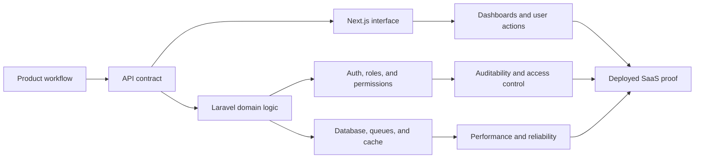
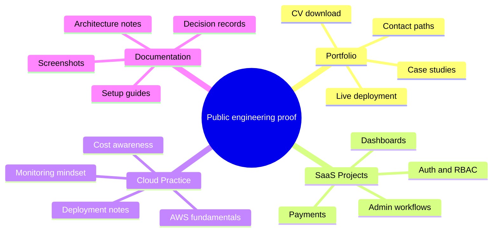

# Silindokuhle Mapiyeye

**Full-Stack SaaS Engineer** building Laravel, Next.js, API-first systems, RBAC workflows, payments, AI-assisted tools, and cloud-ready products.

I like building systems where the backend is clear, the interface is usable, and the business workflow makes sense. My work sits around product dashboards, authentication, roles and permissions, integrations, queues, caching, deployment, and practical cloud foundations.

| Portfolio | LinkedIn | Email |
| --- | --- | --- |
| [mapiyeyes-portfolio.vercel.app](https://mapiyeyes-portfolio.vercel.app) | [silindokuhle-mapiyeye-developer](https://www.linkedin.com/in/silindokuhle-mapiyeye-developer) | [slmapiyeye@gmail.com](mailto:slmapiyeye@gmail.com) |

---

## Engineering Snapshot

```text
Role        Full-Stack SaaS Engineer
Strength    Laravel backends, Next.js interfaces, REST APIs, RBAC, payments
Direction   Cloud-ready SaaS systems, clean proof, strong public projects
Portfolio   https://mapiyeyes-portfolio.vercel.app
```

## Stack Map

| Backend | Frontend | Data & Cache | Cloud & DevOps | Product Workflows |
| --- | --- | --- | --- | --- |
| `PHP` | `TypeScript` | `MySQL` | `AWS` | `RBAC` |
| `Laravel` | `React` | `Redis` | `Docker` | `Payments` |
| `REST APIs` | `Next.js` | `Queues` | `Laravel Forge` | `Dashboards` |
| `Sanctum` | `Tailwind CSS` | `Caching` | `CI/CD` | `Integrations` |
| `Spatie Permission` | `Responsive UI` | `Search` | `Linux` | `AI workflows` |

## How I Think About Systems



## What I Can Build

| Capability | What that means in real work |
| --- | --- |
| SaaS foundations | Authentication, user roles, admin panels, protected routes, onboarding, and account workflows |
| API platforms | REST endpoints, validation, resources, pagination, search, filtering, and frontend integration |
| Permission systems | RBAC planning, Spatie Permission implementation, policy thinking, and dashboard access control |
| Payment flows | Checkout, payment status tracking, operations screens, and business workflow integration |
| Product dashboards | Metrics surfaces, management views, tables, filters, detail pages, and action flows |
| Cloud deployment | Vercel, Forge, AWS fundamentals, Docker, Linux, environment config, and deployment troubleshooting |
| AI-assisted features | Chatbot prototypes, guided support flows, document/search experiences, and workflow automation ideas |

## Current Public Work

| Project | Proof |
| --- | --- |
| [Personal Developer Portfolio](https://github.com/silindokuhleL/mapiyeyes-portfolio) | Live profile hub for CV, skills, DevOps positioning, case studies, analytics hooks, and deployment proof |
| [Document Search Portal](https://github.com/silindokuhleL/document-search-portal) | Upload, parsing, search relevance, suggestions, highlighting, pagination, and caching |
| [Risk Management Frontend](https://github.com/silindokuhleL/risk-management-front-end-next) | Next.js product UI direction for protected workflows and risk-management screens |
| [Risk Management Backend API](https://github.com/silindokuhleL/rick-management-backend-api) | Laravel API foundations for auth, protected workflows, roles, and permissions |
| [Prosuite Chatbot Hackathon](https://github.com/silindokuhleL/prosuite-chatbot-hackathon) | AI-assisted product support and guided chatbot interaction prototype |

## Build Direction



## Working Style

```text
I prefer clear systems over clever ones.
I document setup, decisions, and proof as the project matures.
I keep uncertain claims out of public pages until they are verified.
I care about mobile responsiveness, usable workflows, and deployment readiness.
```

## Focus Right Now

- Building stronger from-scratch SaaS projects with real user workflows.
- Improving public proof through screenshots, READMEs, demos, and case studies.
- Strengthening AWS and cloud practitioner fundamentals.
- Turning private/local project work into understandable engineering evidence.

## Contact

Start with the portfolio: [https://mapiyeyes-portfolio.vercel.app](https://mapiyeyes-portfolio.vercel.app)

For direct contact, email [slmapiyeye@gmail.com](mailto:slmapiyeye@gmail.com) or connect on [LinkedIn](https://www.linkedin.com/in/silindokuhle-mapiyeye-developer).
