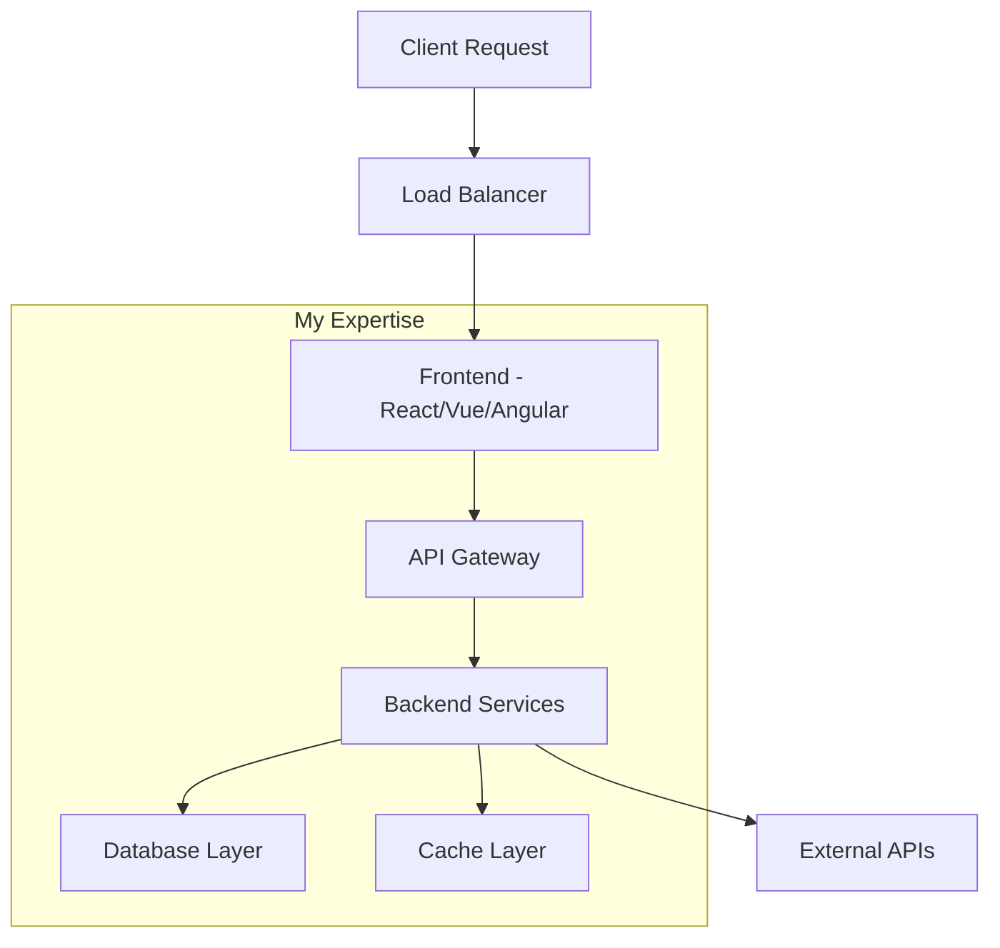

<div align="center">

# Silindokuhle Mapiyeye

Full-Stack SaaS Engineer focused on Laravel, Next.js, APIs, RBAC, payments, AI workflows, queues, caching, and cloud deployments.

[](https://mapiyeyes-portfolio.vercel.app)
[](https://www.linkedin.com/in/silindokuhle-mapiyeye-developer)
[](mailto:slmapiyeye@gmail.com)

</div>

```typescript
/**
 * @fileoverview Developer Profile Configuration
 * @version 3.0.0
 * @author Silindokuhle Mapiyeye
 * @license MIT
 * @lastModified 2025-05-28T10:30:00Z
 */

interface DeveloperProfile {
  readonly metadata: ProfileMetadata;
  readonly core: CoreInformation;
  readonly architecture: TechnicalArchitecture;
  readonly experience: ExperienceMetrics;
  readonly portfolio: ProjectCollection;
  readonly performance: PerformanceMetrics;
  readonly deployment: DeploymentConfig;
  readonly api: APIConfiguration;
}

const SilindokuhleMapiyeye: DeveloperProfile = {
  "metadata": {
    "schema_version": "3.0.0",
    "created_at": "2020-01-15T08:00:00Z",
    "last_updated": "2025-05-28T10:30:00Z",
    "build_status": "stable",
    "health_check": "passing",
    "uptime": "99.9%",
    "environment": "production"
  },

  "core": {
    "identity": {
      "full_name": "Silindokuhle Mapiyeye",
      "username": "silindokuhleL",
      "role": "Senior Full-Stack Developer",
      "specialization": "Modern Web Applications",
      "seniority_level": "senior",
      "years_active": 5
    },
    
    "location": {
      "base": "South Africa 🇿🇦",
      "timezone": "Africa/Johannesburg (GMT+2)",
      "remote_work": true,
      "travel_available": true,
      "languages": ["English", "Zulu", "Xhosa"]
    },

    "contact_matrix": {
      "primary": {
        "email": "slmapiyeye@gmail.com",
        "response_time": "< 24 hours"
      },
      "professional": {
        "linkedin": "https://www.linkedin.com/in/silindokuhle-mapiyeye-developer",
        "portfolio": "https://mapiyeyes-portfolio.vercel.app",
        "activity_level": "active"
      },
      "development": {
        "github": "https://github.com/silindokuhleL",
        "commits_per_week": "25+"
      },
      "social": {
        "twitter": "@silindokuhleL",
        "content_type": "tech_insights"
      }
    }
  },

  "architecture": {
    "frontend": {
      "frameworks": {
        "react": {
          "version": "18.x",
          "experience": "expert",
          "ecosystem": ["Next.js", "Gatsby", "Remix"],
          "state_management": ["Redux Toolkit", "Zustand", "Context API"],
          "testing": ["Jest", "React Testing Library", "Cypress"]
        },
        "vue": {
          "version": "3.x",
          "experience": "expert", 
          "ecosystem": ["Nuxt.js", "Vite", "Quasar"],
          "state_management": ["Pinia", "Vuex"],
          "testing": ["Vue Test Utils", "Vitest"]
        },
        "angular": {
          "version": "15+",
          "experience": "advanced",
          "ecosystem": ["Angular CLI", "Angular Material", "NgRx"],
          "testing": ["Jasmine", "Karma", "Protractor"]
        }
      },
      
      "languages": {
        "typescript": {
          "proficiency": "expert",
          "usage": "primary",
          "features": ["generics", "decorators", "advanced_types"]
        },
        "javascript": {
          "proficiency": "expert",
          "standards": ["ES2022+", "ESNext"],
          "runtime": ["Browser", "Node.js", "Deno"]
        }
      },

      "styling": {
        "methodologies": ["BEM", "OOCSS", "Atomic Design"],
        "frameworks": ["Tailwind CSS", "Styled Components", "Emotion"],
        "preprocessors": ["SASS", "LESS", "PostCSS"],
        "responsive_design": "mobile_first_approach"
      }
    },

    "backend": {
      "frameworks": {
        "laravel": {
          "version": "10.x",
          "experience": "expert",
          "patterns": ["Repository", "Service Layer", "Observer"],
          "packages": ["Sanctum", "Horizon", "Telescope", "Octane"]
        },
        "nodejs": {
          "runtime": "18.x LTS",
          "frameworks": ["Express.js", "Fastify", "NestJS"],
          "experience": "advanced",
          "patterns": ["MVC", "Microservices", "Event-Driven"]
        }
      },

      "databases": {
        "relational": {
          "mysql": {
            "version": "8.0+",
            "expertise": ["Query Optimization", "Indexing", "Replication"]
          },
          "postgresql": {
            "version": "14+",
            "expertise": ["JSON Operations", "Full-text Search", "Partitioning"]
          }
        },
        "nosql": {
          "mongodb": {
            "expertise": ["Aggregation Pipeline", "Sharding", "Replica Sets"]
          },
          "redis": {
            "use_cases": ["Caching", "Session Storage", "Pub/Sub"]
          }
        }
      },

      "api_design": {
        "architectural_styles": ["REST", "GraphQL", "gRPC"],
        "documentation": ["OpenAPI/Swagger", "Postman", "Insomnia"],
        "security": ["JWT", "OAuth 2.0", "API Rate Limiting"],
        "versioning": "semantic_versioning"
      }
    },

    "infrastructure": {
      "containerization": {
        "docker": {
          "expertise": ["Multi-stage builds", "Docker Compose", "Optimization"],
          "registries": ["Docker Hub", "AWS ECR", "GitLab Registry"]
        }
      },
      
      "cloud_platforms": {
        "aws": {
          "services": ["EC2", "S3", "RDS", "Lambda", "CloudFront"],
          "certification_status": "in_progress"
        },
        "digital_ocean": {
          "services": ["Droplets", "Spaces", "App Platform", "Databases"]
        }
      },

      "ci_cd": {
        "platforms": ["GitHub Actions", "GitLab CI", "Jenkins"],
        "practices": ["Automated Testing", "Code Quality Checks", "Security Scanning"]
      }
    }
  },

  "experience": {
    "metrics": {
      "total_projects": 75,
      "production_deployments": 50,
      "lines_of_code": "250k+",
      "code_reviews_conducted": 200,
      "teams_collaborated": 15,
      "mentees_guided": 12
    },

    "specializations": [
      {
        "area": "E-commerce Solutions",
        "technologies": ["Laravel", "Vue.js", "Stripe", "PayPal"],
        "complexity": "enterprise_level"
      },
      {
        "area": "Real-time Applications", 
        "technologies": ["Socket.io", "WebRTC", "Server-Sent Events"],
        "complexity": "high_concurrency"
      },
      {
        "area": "API Development",
        "technologies": ["RESTful", "GraphQL", "Microservices"],
        "complexity": "distributed_systems"
      },
      {
        "area": "Database Optimization",
        "technologies": ["Query Tuning", "Indexing", "Caching Strategies"],
        "impact": "40%+ performance improvement"
      }
    ],

    "problem_solving": {
      "debugging_methodology": "systematic_approach",
      "performance_optimization": "data_driven_decisions",
      "code_quality": "test_driven_development",
      "documentation": "comprehensive_and_updated"
    }
  },

  "portfolio": {
    "featured_applications": [
      {
        "name": "Enterprise E-commerce Platform",
        "type": "full_stack_application",
        "description": "Scalable multi-vendor marketplace with advanced analytics",
        "architecture": {
          "frontend": "Vue.js 3 + Nuxt.js",
          "backend": "Laravel 10 + Microservices",
          "database": "MySQL 8.0 + Redis",
          "infrastructure": "AWS + Docker"
        },
        "features": [
          "Multi-vendor support",
          "Real-time inventory management", 
          "Advanced search with Elasticsearch",
          "Payment gateway integration",
          "Analytics dashboard",
          "Mobile-responsive PWA"
        ],
        "metrics": {
          "users": "10k+ active",
          "transactions": "$500k+ processed",
          "performance": "< 2s load time",
          "uptime": "99.95%"
        },
        "repository": "https://github.com/silindokuhleL/enterprise-ecommerce",
        "live_demo": "https://demo.ecommerce.silindokuhle.dev",
        "case_study": "https://blog.silindokuhle.dev/ecommerce-case-study"
      },
      
      {
        "name": "Collaborative Project Management Suite",
        "type": "saas_application",
        "description": "Real-time collaboration platform with advanced project analytics",
        "architecture": {
          "frontend": "React 18 + Next.js",
          "backend": "Node.js + Express + GraphQL",
          "database": "PostgreSQL + Redis",
          "real_time": "Socket.io + WebRTC"
        },
        "features": [
          "Real-time collaboration",
          "Advanced project analytics",
          "Team communication tools",
          "File sharing and versioning",
          "Integration APIs",
          "Custom workflow automation"
        ],
        "repository": "https://github.com/silindokuhleL/project-management-suite",
        "status": "in_development",
        "expected_launch": "2025-Q3"
      },

      {
        "name": "AI-Powered Content Management System",
        "type": "innovative_solution",
        "description": "CMS with AI-assisted content creation and SEO optimization",
        "architecture": {
          "frontend": "Angular 15 + Angular Material",
          "backend": "Laravel + Python microservices",
          "ai_integration": "OpenAI API + Custom NLP",
          "database": "PostgreSQL + Elasticsearch"
        },
        "innovation_factor": "AI-driven content optimization",
        "repository": "https://github.com/silindokuhleL/ai-cms",
        "status": "prototype_complete"
      }
    ],

    "open_source_contributions": {
      "total_repositories": 25,
      "stars_received": 350,
      "forks_created": 75,
      "pull_requests": 150,
      "notable_contributions": [
        "Laravel community packages",
        "Vue.js ecosystem tools",
        "Developer productivity tools"
      ]
    }
  },

  "performance": {
    "code_quality": {
      "testing_coverage": "> 85%",
      "code_review_approval_rate": "98%",
      "bug_resolution_time": "< 24 hours",
      "documentation_completeness": "95%"
    },

    "delivery_metrics": {
      "project_completion_rate": "100%",
      "on_time_delivery": "95%",
      "client_satisfaction": "4.9/5.0",
      "code_maintainability": "A+ grade"
    },

    "continuous_improvement": {
      "learning_hours_per_week": 10,
      "courses_completed_2024": 8,
      "conferences_attended": 3,
      "technical_blogs_published": 12
    }
  },

  "deployment": {
    "availability": {
      "status": "available_for_hire",
      "contract_types": ["full_time", "part_time", "consulting", "freelance"],
      "preferred_engagement": "long_term_partnerships",
      "notice_period": "2_weeks"
    },

    "work_preferences": {
      "environment": ["remote_first", "hybrid", "occasional_travel"],
      "team_size": ["startup", "mid_size", "enterprise"],
      "project_duration": ["3_months+"],
      "industries": ["fintech", "e_commerce", "saas", "healthcare", "education"]
    },

    "compensation": {
      "hourly_rate": "competitive",
      "project_based": "negotiable",
      "equity_consideration": true,
      "currency_preference": ["USD", "EUR", "ZAR"]
    }
  },

  "api": {
    "endpoints": {
      "GET /profile": "Fetch complete developer profile",
      "GET /skills": "Retrieve technical skill matrix",
      "GET /projects": "List portfolio projects with filters",
      "GET /experience": "Get work experience and metrics",
      "GET /availability": "Check current availability status",
      "POST /contact": "Send message or inquiry",
      "GET /resume": "Download latest resume (PDF)",
      "GET /recommendations": "Fetch client testimonials"
    },

    "rate_limiting": {
      "requests_per_hour": 100,
      "burst_limit": 20,
      "authentication": "API_key_required_for_sensitive_data"
    },

    "response_format": {
      "content_type": "application/json",
      "encoding": "UTF-8",
      "compression": "gzip",
      "cache_headers": "appropriate_caching_strategy"
    }
  }
};

export default SilindokuhleMapiyeye;

// Type definitions for better IDE support
export type { DeveloperProfile };

/**
 * Health check endpoint
 * @returns {Promise<HealthStatus>} Current system status
 */
async function healthCheck(): Promise<{status: 'healthy' | 'degraded' | 'down'}> {
  return {
    status: 'healthy'
  };
}

/**
 * Initialize developer instance
 * @param config - Configuration options
 */
function initializeDeveloper(config?: Partial<DeveloperProfile>) {
  console.log('🚀 Developer instance initialized successfully!');
  console.log('📡 All systems operational');
  console.log('☕ Coffee levels: optimal');
  console.log('💡 Ready to build amazing things!');
}

// Auto-initialize
initializeDeveloper();
```

---

<div align="center">

## 📊 System Monitoring Dashboard


</div>

---

### 🏗️ Architecture Diagram



---

### 🚀 Quick Start Guide

```bash
# Clone the developer
git clone https://github.com/silindokuhleL/silindokuhleL.git
cd silindokuhleL

# Install dependencies
npm install --save motivation creativity problem-solving

# Configure environment
cp .env.example .env
echo "COFFEE_LEVEL=maximum" >> .env
echo "DEBUGGING_MODE=rubber_duck" >> .env

# Start development server
npm run dev:amazing-solutions

# Deploy to production
npm run deploy:world-changing-apps
```

---

### 📡 API Integration

```javascript
// Example API usage
const developer = await fetch('https://api.silindokuhle.dev/profile');
const skills = await developer.json();

console.log(skills.architecture.frontend.react.experience); // "expert"
console.log(skills.deployment.availability.status); // "available_for_hire"
```

---

### 🔌 Connect to Developer API

[](https://mapiyeyes-portfolio.vercel.app)
[](https://www.linkedin.com/in/silindokuhle-mapiyeye-developer)
[](https://github.com/silindokuhleL)
[](mailto:slmapiyeye@gmail.com)

---

<div align="center">


### Status: `HTTP 200 OK` ✅ | Uptime: 99.9% | Response Time: < 100ms

**💬 "Turning coffee into code since 2020"**

</div>
