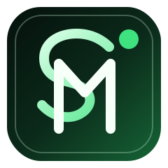
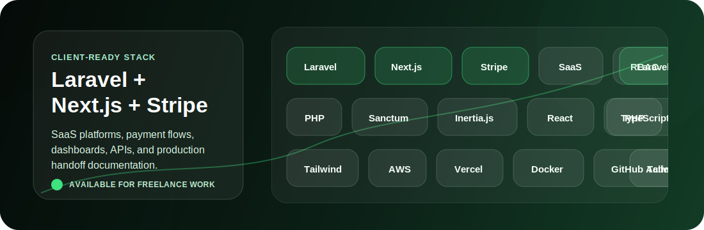

<p align="right">
  
</p>

# Silindokuhle Mapiyeye

**I help businesses build production-ready SaaS platforms with Laravel, Next.js, payments, dashboards, APIs, and cloud deployment.**

I turn messy product ideas into maintainable systems that clients can launch, operate, and improve. My strongest work is full-stack SaaS delivery: backend architecture, secure user access, admin workflows, payments, clean interfaces, and deployment-ready code.

**Why work with me:** I combine backend depth with product UI delivery, so you get someone who can build the workflow, not just the screen.

| Status | Portfolio | Direct Contact |
| --- | --- | --- |
| Available for freelance work | [mapiyeyes-portfolio.vercel.app](https://mapiyeyes-portfolio.vercel.app) | [slmapiyeye@gmail.com](mailto:slmapiyeye@gmail.com) |



## Currently Available for Freelance Work

I am open to freelance and contract projects where a business needs a practical web platform built properly from the start.

Good-fit projects include SaaS dashboards, booking systems, internal tools, payment workflows, admin portals, API platforms, and Laravel or Next.js rebuilds that need cleaner structure.

**Next step:** send the business goal, the workflow you need built, and any deadline or budget range to [slmapiyeye@gmail.com](mailto:slmapiyeye@gmail.com).

## What I Bring to Your Project

| Need | How I help |
| --- | --- |
| Launch a SaaS product | Build the Laravel backend, Next.js interface, auth, roles, admin screens, and deployment path |
| Fix a messy app | Rework structure, clean up workflows, improve maintainability, and document the setup |
| Add payments | Implement payment flows, status tracking, operational screens, and user-facing checkout journeys |
| Build protected workflows | Design role-based access, permissions, policies, dashboards, and secure route behavior |
| Create API-first systems | Build REST endpoints, validation, resources, pagination, filtering, and frontend integration |
| Prepare for production | Set up environment config, deployment notes, cloud basics, and handoff documentation |

## Core Stack

These are the tools I lead with when building client-ready SaaS systems.

| Product Core | Backend | Frontend | Cloud & Delivery |
| --- | --- | --- | --- |
|  |  |  |  |
|  |  |  |  |
|  |  |  |  |
|  |  |  |  |
|  |  |  |  |

I also work with Redis, queues, caching strategy, search experiences, admin reporting, and AI-assisted workflow ideas when the product needs them.

## Services

| Service | Best for |
| --- | --- |
| SaaS MVP build | Founders or teams that need a functional product with auth, dashboards, payments, and admin workflows |
| Laravel backend development | APIs, database design, validation, jobs, queues, permissions, and secure business logic |
| Next.js product interfaces | Responsive dashboards, forms, tables, filters, detail views, and customer-facing flows |
| Payment workflow implementation | Checkout, subscriptions or one-time payments, payment status screens, and operational tracking |
| Admin and internal tools | Staff dashboards, management panels, workflow automation, reporting screens, and role-based access |
| Technical cleanup and handoff | Refactoring, documentation, setup notes, deployment fixes, and maintainability improvements |

## How We Work Together

| Step | What happens | Result |
| --- | --- | --- |
| 1. Discovery | We clarify the business goal, users, workflows, must-have features, and constraints | Clear scope and priority list |
| 2. Scoping | I map the screens, data, roles, API needs, and delivery milestones | A build plan you can understand |
| 3. Build | I develop in small, reviewable pieces with working demos and regular progress updates | Product features you can test early |
| 4. Handoff | I document setup, deployment, key decisions, and next steps | A maintainable system, not a mystery box |

## Recent Work and Case Studies

| Project | Problem | Built | Outcome |
| --- | --- | --- | --- |
| [Personal Developer Portfolio](https://github.com/silindokuhleL/mapiyeyes-portfolio) | Needed a clear public proof hub for skills, CV, experience, and case studies | Next.js portfolio, CV download, project proof blocks, analytics hooks, and Vercel deployment | A live profile clients and recruiters can inspect |
| [Document Search Portal](https://github.com/silindokuhleL/document-search-portal) | Users need to find relevant content inside uploaded documents faster | Upload flow, parsing, search relevance, suggestions, highlighting, pagination, and caching | Better document discovery workflow |
| [Risk Management Frontend](https://github.com/silindokuhleL/risk-management-front-end-next) | Protected risk workflows needed a product interface direction | Next.js screens for protected workflows and risk-management flows | Frontend foundation for a business dashboard |
| [Risk Management Backend API](https://github.com/silindokuhleL/rick-management-backend-api) | Risk workflows needed backend structure for access and protected operations | Laravel API foundations for auth, roles, permissions, and protected resources | Backend base for secure business logic |
| [Prosuite Chatbot Hackathon](https://github.com/silindokuhleL/prosuite-chatbot-hackathon) | Product support needed an AI-assisted interaction prototype | Guided chatbot flow for support-style interaction | Fast proof of concept for AI-assisted user support |

## What You Can Expect

```text
Clear scope before build
Maintainable code over shortcuts
Documented setup and handoff notes
Mobile-conscious, usable interfaces
Honest communication about risks and tradeoffs
Production-minded decisions from the beginning
```

## GitHub Activity

These cards use external GitHub activity services. The profile still works without them, but they give a quick signal that I am actively building.

<p>
  
  
</p>

## Start a Project

I am currently available for freelance work on SaaS platforms, dashboards, Laravel APIs, payment workflows, internal tools, and Next.js product interfaces.

Send a short message with what you want to build: [slmapiyeye@gmail.com](mailto:slmapiyeye@gmail.com)

Portfolio: [https://mapiyeyes-portfolio.vercel.app](https://mapiyeyes-portfolio.vercel.app)  
LinkedIn: [https://www.linkedin.com/in/silindokuhle-mapiyeye](https://www.linkedin.com/in/silindokuhle-mapiyeye)
